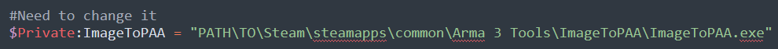

# Convert-into-PAA
Originally created for the non-profit organization [Projets Edaly](https://edaly.fr/fr/home) - [Github Projets Edaly](https://github.com/Projets-Edaly), i decided to share this script that converts png, jpg, jpeg or tga files into paa files.
The first version will be for single files (right-click on a file) and later i'll add another script that add a contextual menu item to convert all images (in the folder) into paa files.

# Single File

## Configuration
1. :spiral_notepad: Edit "Single File/install-ImageToPAA.bat" with any text editor
2. :pencil2: Modify ImageToPAA executable path line 15

 

3. :floppy_disk: Save and close the file

## Install
Run
```
.\Single File\install-ImageToPAA.ps1
```

## Uninstall
Run
```
.\Single File\uninstall-ImageToPAA.ps1
```

## Usage
Right click on any image you want to build into PAA.

## Author
* **Kira** - [Kira](https://github.com/TKiraa)
